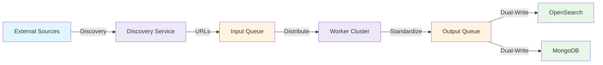
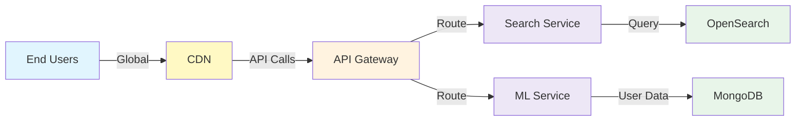

# Enterprise Architecture Patterns Repository

Welcome to a curated collection of **production-grade enterprise architecture patterns** for building scalable, resilient data platforms. Each pattern demonstrates proven design decisions, trade-offs, and implementation strategies used in real-world systems handling massive scale, cloud migrations, and complex data workflows.

## 📚 Table of Contents

1. [Distributed Data Ingestion](#distributed-data-ingestion)
2. [Content Discovery & Personalization](#content-discovery--personalization)
3. [Legacy Monolith to Microservices (Coming Soon)](#legacy-monolith-to-microservices)
4. [Enterprise Agentic AI Pipelines (Coming Soon)](#enterprise-agentic-ai-pipelines)
5. [Architecture Principles](#architecture-principles)

---

## Patterns Overview

### 1. Distributed Data Ingestion

**Use Case:** Building a high-throughput, resilient data pipeline to safely ingest unstructured data from heterogeneous external sources into a secure, controlled environment.

**Key Characteristics:**
- Distributed worker nodes for parallel extraction
- Queue-based decoupling for horizontal scalability
- Zero-trust VPC security with mTLS
- Real-time search + historical auditing dual-write pattern

[→ Explore Pattern →](./distributed-crawlers/README.md)

---

### 2. Content Discovery & Personalization

**Use Case:** Building a client-facing platform that serves millions of entities with hybrid discovery (rule-based + ML) and real-time personalization at global scale.

**Key Characteristics:**
- Hybrid search engine (rule-based + ML recommendations)
- Dynamic localization at the serving layer
- Closed-loop telemetry for continuous model tuning
- CDN + SPA frontend for sub-second global loads

[→ Explore Pattern →](./content-discovery-and-personalization/README.md)

---

### 3. Legacy Monolith to Microservices (In Progress)

**Use Case:** Refactoring a legacy computational monolith into a highly scalable, event-driven microservices architecture on AWS. Details parallel compute orchestration, API-first design, and cloud cost-optimization.

---

### 4. Enterprise Agentic AI Pipelines (In Progress)

**Use Case:** Deploying custom machine learning models, secure prompt engineering workflows, and multi-modal LLMs for extracting intelligence from unstructured enterprise telemetry.

---

## Architecture Principles

These patterns are built on five core principles:

### 1. **Decoupling via Message Queues**
Services communicate asynchronously to enable independent scaling and failure isolation.

### 2. **Dual-Write Patterns**
Data flows to both operational stores (for low-latency queries) and stateful stores (for historical analysis) simultaneously.

### 3. **Security by Isolation**
Services are deployed in private subnets within secure VPCs with strict Bastion/API Gateway ingress.

### 4. **Microservices with Clear Boundaries**
Each service has a single, bounded responsibility enabling independent deployment.

### 5. **Closed-Loop Feedback**
Telemetry and user signals feedback into the system for continuous model retraining.

---

## Technology Stack

| Layer | Technology | Purpose |
|-------|-----------|---------|
| **Compute** | AWS EC2, Docker | Scalable compute and containerized microservices |
| **Messaging** | RabbitMQ / AWS SQS | Asynchronous decoupling and work distribution |
| **Search & DB** | AWS OpenSearch, MongoDB | Real-time vector/text search and write-optimized temporal storage |
| **AI / ML** | LangChain, pgvector, LLMs | Multi-modal intelligence and recommendation engines |
| **Delivery** | CloudFront CDN, Next.js | Global content delivery and decoupled UI |

---

## Real-World Applicability

These patterns are derived from production systems and high-fidelity architectural prototypes handling:

- 10+ million entities indexed and served globally
- High-throughput, event-driven pipelines processing millions of unstructured data points.
- Sub-second latency hybrid search requirements
- Legacy-to-Cloud modernization deployments

---

**Last Updated:** February 2026  
**Author:** Bharanidharan Hemachandran
