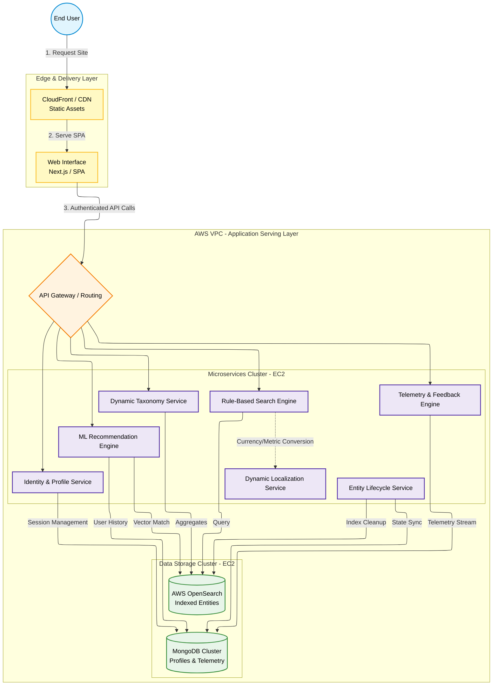

# Pattern: Scalable Content Discovery & Personalization Platform

## 📋 Overview

This pattern defines a **client-facing presentation and data-serving layer** that leverages the ingested data to deliver personalized content experiences. The architecture is deployed on AWS EC2 instances and serves millions of indexed entities to global end-users with a hybrid discovery model (rule-based search + ML recommendations), dynamic real-time data localization, and a closed-loop telemetry system for continuous profile and data-quality tuning.

### Use Cases
- Multi-tenant content discovery platforms (e-commerce, travel, job boards)
- Personalized recommendation engines with A/B testing
- Global marketplace serving with dynamic localization (currency, language, region)
- Real-time user preference profiling and model retraining
- Sub-second content retrieval with 99.99% availability

### Scale
- 10+ million entities indexed and globally searchable
- Global user base supported by Edge/CDN delivery
- Real-time personalization decisions (sub-second latency)
- Continuous model retraining from telemetry signals
- High-availability single-region compute with global edge caching

## System Architecture

## 🏗️ Core Components

| Layer | Component | Purpose |
|-------|-----------|---------|
| **Delivery** | CloudFront CDN | Global static asset caching for <100ms page loads worldwide |
| **Frontend** | Next.js SPA | Client-side rendering with server-side session management |
| **Routing** | API Gateway | Request routing, rate limiting, request validation |
| **Identity** | Auth Service | Session management, OAuth integration, user context |
| **Taxonomy** | Dynamic Taxonomy Service | Real-time entity classification and hierarchical categorization |
| **Discovery** | Rule-Based Search Engine | Exact-match and faceted search against OpenSearch indices |
| **Personalization** | ML Recommendation Engine | Vector-based similarity and collaborative filtering |
| **Localization** | Dynamic Localization Service | Real-time currency conversion, language, and regional customization |
| **Lifecycle** | Entity Lifecycle Service | Automated deprecation, tombstoning, and stale data removal |
| **Feedback** | Telemetry & Feedback Engine | User signal capture for model retraining and quality metrics |
| **Search Index** | AWS OpenSearch | Distributed search index for rule-based queries and vector embeddings |
| **Profile & State** | MongoDB Cluster | User profiles, preferences, historical telemetry, session state |

## 📊 Data Flow Sequence

1. **User Request:** End user accesses site via CDN-cached Next.js SPA frontend
2. **Authentication:** Request routed through API Gateway to Auth Service for session validation
3. **Discovery Phase:** 
   - **Rule-Based Path:** User's exact query sent to Rule-Based Search Engine → OpenSearch returns direct matches
   - **Personalization Path:** User profile and query context sent to ML Recommendation Engine → Returns ranked suggestions based on vectors and collaborative signals
4. **Localization:** Taxonomy Service and Localization Service apply user's regional preferences (currency, language, availability)
5. **Response:** Merged ranked results returned to frontend for rendering
6. **Feedback Loop:** Client-side analytics and user interactions captured by Telemetry Engine → stored in MongoDB
7. **Continuous Improvement:** ML models retrained nightly using accumulated telemetry signals

### Key Engineering Decisions & Trade-offs

- **Decoupled Front-end Architecture:** SPA (Next.js) with static assets cached at the CDN for sub-second global page loads and reduced compute load on EC2.
- **Hybrid Discovery Engine:** Rule-based Search for exact queries against OpenSearch; ML Recommendation Engine uses MongoDB profiles and entity vectors for personalized suggestions.
- **Abstracted Localization (Microservice Pattern):** Dynamic Localization Service fetches exchange rates and performs conversions at runtime, keeping OpenSearch indices standardized.
- **Automated Entity Lifecycle (Tombstoning):** Entity Lifecycle Service listens for deprecation signals, removes stale items from OpenSearch, and flags them in MongoDB to maintain index fidelity.
- **Closed-Loop Telemetry:** Telemetry & Feedback Engine captures user feedback to MongoDB to retrain ML models, enabling continuous improvement.
