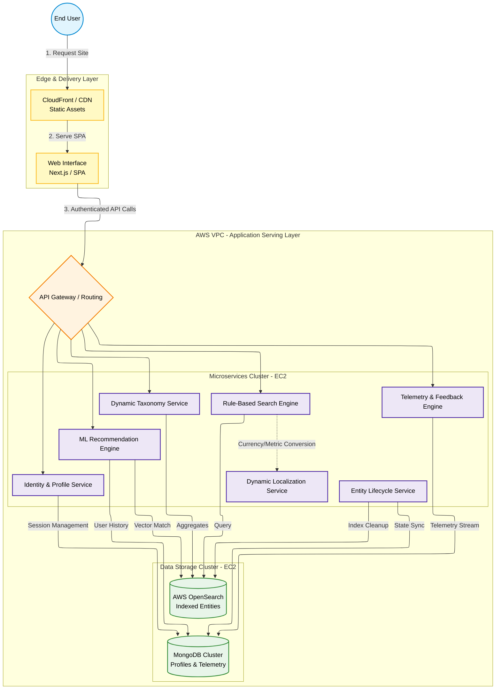

# Scalable Content Discovery & Personalization Platform

## Architecture Overview

This architecture defines the client-facing presentation and data-serving layer. Deployed entirely on AWS EC2 instances, this microservices ecosystem is designed to serve millions of indexed entities to global end-users. It features a hybrid discovery model (combining rule-based search with ML-driven recommendations), dynamic real-time data localization, and a closed-loop telemetry system to continuously tune user profiles and data quality.

### Key Engineering Decisions & Trade-offs

- **Hybrid Discovery Engine:** Balances strict user intent with serendipitous discovery via a dual-engine approach. Rule-based search queries OpenSearch for exact matches and filters, while the ML recommendation engine cross-references user profiles in MongoDB against entity vectors for personalized suggestions.

- **Abstracted Localization (Microservice Pattern):** A dedicated Dynamic Localization Service pulls daily exchange/metric rates from external APIs and provides runtime conversions to the Search Service. This keeps the OpenSearch index standardized and avoids storing localized variants.

- **Automated Entity Lifecycle (Tombstoning):** The Entity Lifecycle Service listens for deprecation signals and synchronously removes or tombstones entries in OpenSearch and flags records in MongoDB to prevent stale results.

- **Closed-Loop Telemetry:** The Telemetry & Feedback Engine captures explicit user feedback (comments, ratings, reward interactions) and writes it to MongoDB. This data is used to retrain ML models, creating an automated improvement loop.