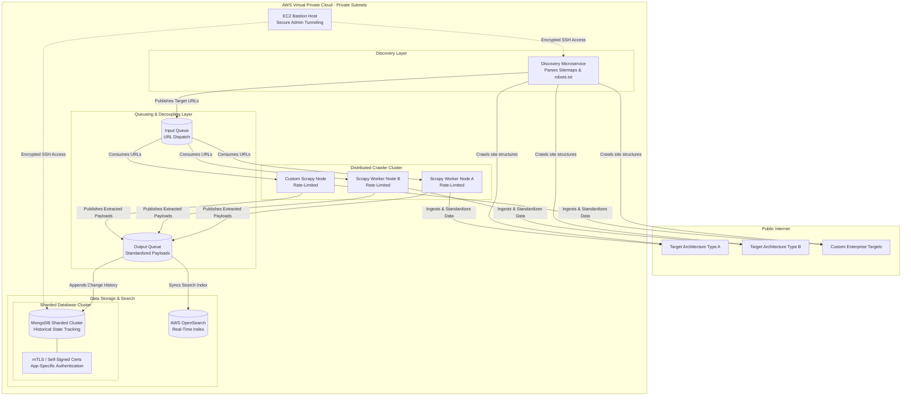

# Distributed High-Throughput Data Ingestion Engine

## Architecture Overview
This repository details the architecture for a highly scalable, distributed data ingestion pipeline deployed entirely within a secure AWS VPC. The system is designed to independently discover, rate-limit, and extract unstructured data from highly variable external web architectures, standardize the payloads, and route them for both real-time search and historical state tracking.

### Key Engineering Decisions & Trade-offs

- **Asynchronous Decoupling:** The Discovery Microservice (handling robots.txt and sitemap traversal) is strictly decoupled from the worker nodes via an Input Queue. This allows the extraction layer to scale horizontally based on queue depth without overwhelming target servers.

- **Write-Optimized Storage:** Because the system tracks entity mutations over time (historical change tracking), a fully sharded MongoDB cluster was deployed to handle the massive write-throughput, rather than a traditional relational database.

- **Zero-Trust VPC Security:** The entire database and queueing architecture is locked within private subnets with zero external ingress. Administration is strictly routed through an EC2 Bastion host, and database access is secured via mutual TLS (mTLS) using application-specific, self-signed certificates for granular access control.

- **Dual-Write Output Routing:** The Output Queue fans out standardized data. It synchronizes the latest state into AWS OpenSearch for sub-second retrieval, while simultaneously appending the temporal data to MongoDB for historical auditing and longitudinal analysis.