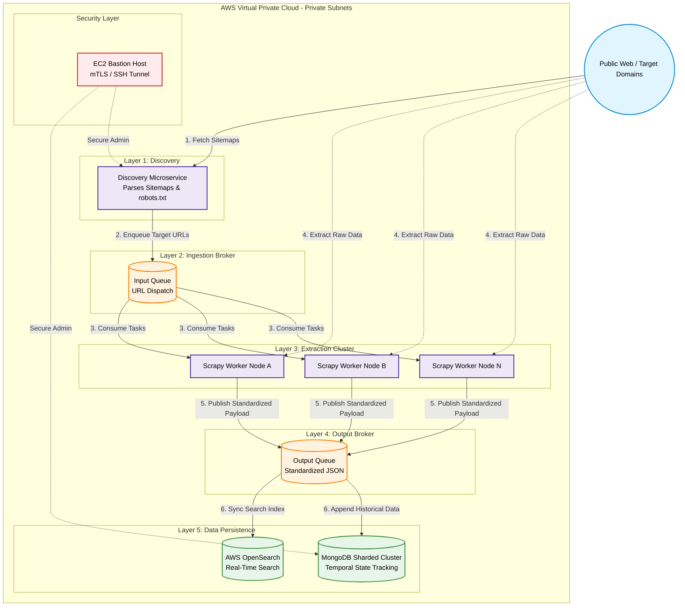

# Pattern: Distributed High-Throughput Data Ingestion Engine

## 📋 Overview

This pattern details the architecture for a **highly scalable, distributed data ingestion pipeline** deployed entirely within a secure AWS VPC. The system is designed to independently discover, rate-limit, and extract unstructured data from highly variable external web architectures, standardize the payloads, and route them for both real-time search and historical state tracking.

### Use Cases
- Continuous web scraping and data discovery at scale
- ETL pipelines ingesting data from heterogeneous sources
- Real-time indexing while maintaining historical archives
- Secure data extraction from external sources into private VPCs

### Scale
- Horizontal worker scaling based on queue depth
- Support for tens of millions of write-heavy historical records
- Sub-second latency for new data availability in search indexes
- Protection against rate limiting and target server overload

## System Architecture

## 🏗️ Core Components

| Layer | Component | Purpose |
|-------|-----------|---------|
| **Discovery** | Discovery Microservice | Parses sitemaps, robots.txt, and URL feeds from external sources |
| **Ingestion Broker** | Input Queue (SQS/Kafka) | Distributes URLs to worker nodes; acts as buffer for rate limiting |
| **Extraction** | Scrapy Worker Cluster | Parallel HTTP extraction with rate limiting and retry logic |
| **Output Broker** | Output Queue (SQS/Kafka) | Standardizes payloads before routing to downstream systems |
| **Search Store** | AWS OpenSearch | Indexes latest document versions for real-time search |
| **Historical Store** | MongoDB Sharded Cluster | Immutable append-only log of all document versions |
| **Security** | EC2 Bastion Host | Single point of administrative access via mTLS tunneling |
| **Network** | AWS VPC Private Subnets | Zero direct internet ingress; outbound crawler traffic routed via NAT Gateways |

## 📊 Data Flow Sequence

1. **Discovery Phase:** Discovery Microservice crawls robots.txt and sitemap feeds, enqueues target URLs to Input Queue
2. **Distribution Phase:** Multiple worker nodes pull tasks from Input Queue independently, respecting rate limits
3. **Extraction Phase:** Scrapy workers fetch raw HTML/JSON from external targets with fault tolerance and retry logic
4. **Standardization Phase:** Workers normalize payloads to common schema (fields, encoding, validation)
5. **Output Phase:** Standardized payloads published to Output Queue for fan-out consumption
6. **Dual-Write Phase:** 
   - Synchronously indexes latest version to OpenSearch for sub-second search availability
   - Asynchronously appends historical record to MongoDB for audit trail and temporal queries

### Key Engineering Decisions & Trade-offs

- **Asynchronous Decoupling:** The Discovery Microservice (handling robots.txt and sitemap traversal) is strictly decoupled from the worker nodes via an Input Queue. This allows the extraction layer to scale horizontally based on queue depth without overwhelming target servers.

- **Write-Optimized Storage:** Because the system tracks entity mutations over time (historical change tracking), a fully sharded MongoDB cluster was deployed to handle the massive write-throughput, rather than a traditional relational database.

- **Zero-Trust VPC Security:** The entire database and queueing architecture is locked within private subnets with zero external ingress. Administration is strictly routed through an EC2 Bastion host, and database access is secured via mutual TLS (mTLS) using application-specific, self-signed certificates for granular access control.

- **Dual-Write Output Routing:** The Output Queue fans out standardized data. It synchronizes the latest state into AWS OpenSearch for sub-second retrieval, while simultaneously appending the temporal data to MongoDB for historical auditing and longitudinal analysis.