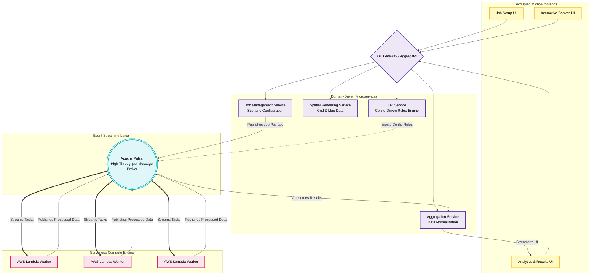

# Pattern: Legacy Monolith to Event-Driven Microservices

## 📋 Overview

This pattern details the architectural refactoring of a tightly coupled, legacy monolithic processing platform into a highly scalable, event-driven microservices architecture. By decoupling the frontend into purpose-built micro-UIs and transitioning computational workloads to serverless workers driven by Apache Pulsar, the system achieves horizontal scalability and reduced infrastructure overhead.

### Use Cases
- Modernizing legacy monolithic platforms with tight coupling between frontend and backend
- Migration of synchronous, blocking workloads to asynchronous, event-driven patterns
- Enabling independent deployment of frontend and backend services
- Scaling computational workloads without scaling the web tier

### Scale
- Instant horizontal scaling from zero to thousands of parallel executions
- Event-driven architecture supporting high-throughput data processing
- Cost-optimized compute with serverless ephemeral workers
- Independent scaling of UI, services, and compute layers

## System Architecture

## 🏗️ Core Components

| Layer | Component | Purpose |
|-------|-----------|---------|
| **Frontend** | Micro-Frontends | Independent UI services by domain (Setup, Canvas, Analytics) enabling parallel development |
| **Routing** | API Gateway | Routes requests from micro-frontends to appropriate domain microservices |
| **Services** | Domain Microservices | Isolated business logic: Job Management, Spatial Rendering, Data Aggregation |
| **Extensibility** | Config-Driven KPI Service | Allows new metrics and rules to be injected via configuration without code changes |
| **Event Broker** | Apache Pulsar | High-throughput message broker decoupling web tier from compute tier |
| **Compute Engine** | AWS Lambda Workers | Serverless ephemeral compute instances scaling based on workload |

## 📊 Data Flow Sequence

1. **Request Phase:** End user interacts with domain-specific micro-frontend (Setup, Canvas, or Analytics)
2. **Routing Phase:** Request routed through API Gateway to appropriate domain microservice
3. **Task Enqueuing:** Service publishes job payload and configuration rules to Apache Pulsar
4. **Distributed Processing:** AWS Lambda workers consume tasks from Pulsar queue, process in parallel
5. **Result Publishing:** Workers publish processed results back to Pulsar
6. **Aggregation Phase:** Aggregation Service consumes results, normalizes data
7. **UI Updates:** Analytics results streamed to frontend via WebSocket or polling

## 🔧 Key Engineering Decisions & Trade-offs

- **Micro-Frontends over SPA Monolith:** UI was decoupled into functional domain-specific components, allowing different teams to release updates independently without impacting other services.

- **Config-Driven Rules Engine:** Extracting the KPI service into a configuration-driven component allows business logic changes without code deployments, reducing feedback cycles for new metrics and rules.

- **Serverless Event-Driven Compute:** Transitioning from persistent worker nodes to AWS Lambdas orchestrated by Apache Pulsar aligns compute costs with actual workload, scaling from zero to thousands of executions instantaneously with zero cost when idle.

- **Asynchronous Result Streaming:** Long-running computational workloads do not block web services. Results are published through Apache Pulsar, aggregated, and streamed to UIs asynchronously via WebSocket or polling, improving overall system responsiveness.