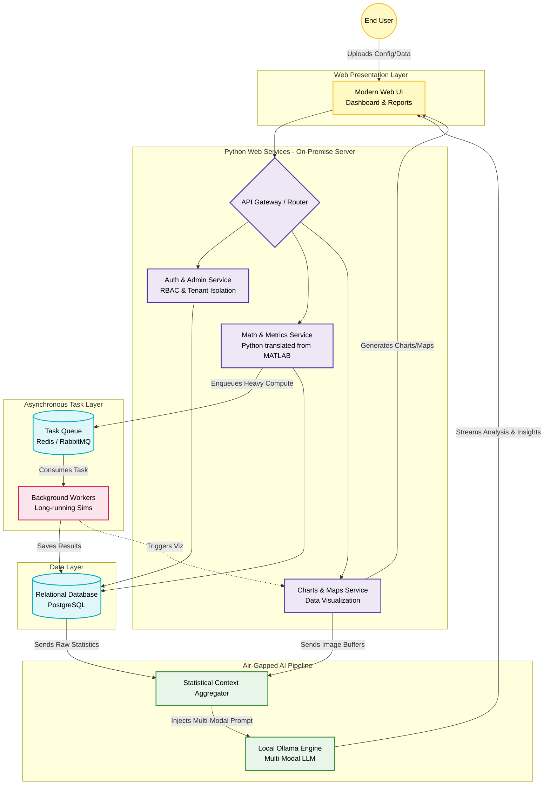

# Pattern: Secure Local AI Modernization & Multi-Modal Analytics

## 📋 Overview

This pattern details the modernization of a legacy, single-user desktop engineering application (MATLAB) into a secure, multi-tenant Python web platform. The architecture features an asynchronous task queue for heavy mathematical processing and a fully air-gapped, local Generative AI pipeline (Ollama) to perform multi-modal analysis on generated charts and statistical data without exposing proprietary intellectual property to public cloud LLMs.

### Use Cases
- Modernizing legacy desktop engineering/mathematical models to scalable web services
- Deploying GenAI and LLMs in highly regulated, air-gapped, or on-premise environments
- Automated, multi-modal report generation (analyzing data and chart images simultaneously)
- Protecting highly sensitive intellectual property from public API exposure

### Scale & Constraints
- 100% on-premise/private server deployment with zero external AI API dependencies
- Asynchronous queuing for long-running mathematical simulations
- Multi-modal local inferencing (processing statistical context and generated image buffers)
- Role-based access control (RBAC) and multi-tenant user administration

## System Architecture

## 🏗️ Core Components

| Layer | Component | Purpose |
|-------|-----------|---------|
| **Gateway & Auth** | API Router & Admin Service | Manages JWT sessions, role-based access control, and user administration |
| **Compute Core** | Python Math Service | Replaces legacy MATLAB code with scalable Python numerical libraries |
| **Task Orchestration** | Background Workers & Queue | Offloads heavy mathematical simulations to prevent web server blocking |
| **Visualization** | Charts & Maps Service | Generates dynamic visualizations from simulation outputs for UI and AI |
| **AI Orchestration** | Context Aggregator | Formats statistical data and image buffers into optimized multi-modal prompts |
| **Local LLM Engine** | Ollama | Runs quantized multi-modal LLMs entirely locally, ensuring zero data leakage |
| **Persistence** | PostgreSQL & Redis | Stores user state, simulation results, and manages asynchronous task states |

## 📊 Data Flow Sequence

1. **Ingestion & Auth:** User logs into platform and submits engineering parameters. Auth service validates tenant boundaries.
2. **Simulation Execution:** API routes parameters to Math Service, which enqueues the job to Task Queue.
3. **Background Processing:** Python workers consume jobs, run complex numerical simulations, write raw output to database.
4. **Visualization Generation:** Charts & Maps service reads output, generates statistical charts and map overlays.
5. **Multi-Modal Context Assembly:** Statistical Aggregator collects numerical metrics and chart image buffers, formats into prompt template.
6. **Local Inferencing:** Context sent to local Ollama instance. Multi-modal LLM analyzes charts alongside statistics, generates engineering report.
7. **Delivery:** Final report and interactive charts streamed back to Web UI.

## 🔧 Key Engineering Decisions & Trade-offs

- **Local AI vs. Public Cloud APIs:** Hosting quantized LLMs locally via Ollama ensures proprietary engineering data never traverses public internet, satisfying strict enterprise compliance while delivering GenAI capabilities.

- **Python Rewrite of MATLAB Monolith:** Translating desktop-bound MATLAB mathematical models into containerized Python (NumPy/SciPy) decouples the engine, wraps it in REST API, and enables execution via scalable worker queues.

- **Multi-Modal Prompt Engineering:** System feeds both statistical data and generated charts to multi-modal models, allowing AI to catch visual anomalies and describe spatial relationships difficult to infer from tabular data alone.

- **Asynchronous Task Queuing:** Numerical simulations run for minutes. Web tier remains asynchronous; users queue multiple jobs, monitor progress, and receive reports upon completion without holding connection threads open.
